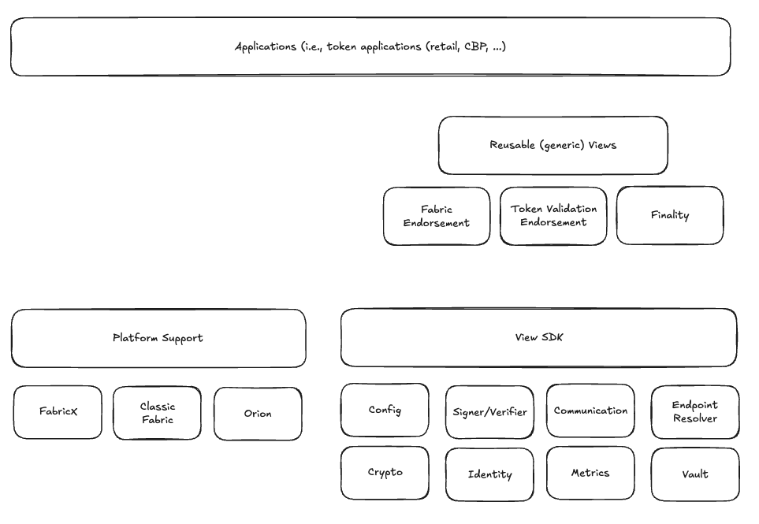

# Hyperledger Fabric-x Endorser

## Overview

This repository contains the Fabric-X platform implementation for the [Fabric Smart Client (FSC)](https://github.com/hyperledger-labs/fabric-smart-client).

### What is endorsement?

Every application has an endorsement policy which specifies a set of parties/organizations that must execute/validate and "endorse" the execution/validation results in order for the transaction to be considered valid.

For example, in a token-based application that uses the privacy-preserving setting, the endorsers are responsible to validate the token ZKPs, create fabricX transaction, and cryptographically sign (endorse) it. This signed transaction is then submitted to the ordering service of the settlement engine and eventually validated and committed by the committer.

In other words, endorsement is the final step of very application to determine if a transaction can be considered valid or not before it is sent to the network for settlement. Note that eventually every submitted transaction is validated by the committers, that is, it is checked that a transaction satisfies the corresponding application endorsement policy. The actual endorsement logic clearly depends on the application, though, some reusable endorsement components exist, i.e., token endorsement (see more details at the Fabric Token SDK).

### How is it different from classic Hyperledger Fabric endorsement?

The EndorserX builds on top of the Fabric Smart Client (FSC), an open-source project. An application endorsement logic is realized as a View implementation using the View SDK as provided by FSC.

This is different from classic Fabric, where parts of the application logic is realized as chaincode and executed/endorsed by a set of Fabric Peers.

With FabricX, the endorser can be part of an existing application or hosted as an independent node.

That is, the endorserX is considered to be an SDK/framework rather than other platform components such as the ordering service or the committer.

Moreover, EndorserX extends the classic Fabric endorsement capabilities with threshold endorsements (cryptographic threshold signatures) and allows to implement interactive protocols among endorsers to facilitate more complex use cases.

### Technology - Fabric Smart Client

A framework for application development for Fabric-X and Fabric classic

- Open source: https://github.com/hyperledger-labs/fabric-smart-client
  - Multiple-platform Support, i.e., classic Fabric, Orion
- Fabric-X Platform Support (this repository) https://github.com/hyperledger/fabric-x-endorser
- View SDK for application development
- Reusable (generic) endorsement views exist

### Further reading

- Elli Androulaki, Angelo De Caro, Matthias Neugschwandtner, Alessandro Sorniotti: Endorsement in Hyperledger Fabric. Blockchain 2019: 510-519 (https://ieeexplore.ieee.org/document/8946133)
- Classic Fabric Endorsement background: https://hyperledger-fabric.readthedocs.io/en/latest/endorsement-policies.html

## Contributions

See [CONTRIBUTING.md](CONTRIBUTING.md)

## Disclaimer

This code is provided for evaluation purposes only. It is a preview version and is not production-ready. The code may be incomplete, contain bugs, or lack necessary security and performance optimizations.
It should not be used in any production environment until the final, stable release is made available.

## License

Hyperledger Fabric source code is available under the **Apache License, Version 2.0 (Apache-2.0)**, and documentation files are under the **Creative Commons Attribution 4.0 International License (CC-BY-4.0)**.
